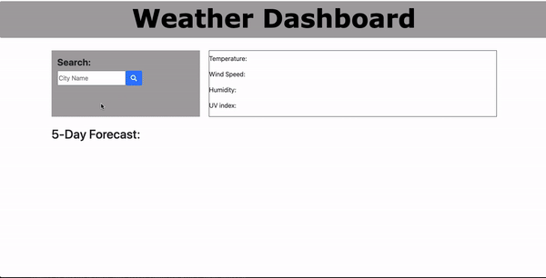

  # Weather App Dashboard

  ## Description
  Creating an weather application by using a 3rd party API. The importance of this homework is to learn how to fetch and apply the API to your own application as well as using localStorage to store user's input. Users will be able to input any city name and will be giving weather information and the next five days as well.

  ## Time of Contents
  - [License](#license)
  - [Usage](#Usage)
  - [Tests](#tests)
  - [Questions](#questions)

  ## Usage
  - `Visual Studiocode`: text editor
  - [API](https:///openweathermap.org): for the weather API

  ## License
  MIT License

  ## Tests
  

  ## Questions?
  Email: victortran@gmail.com

  gitHub: victortran415
